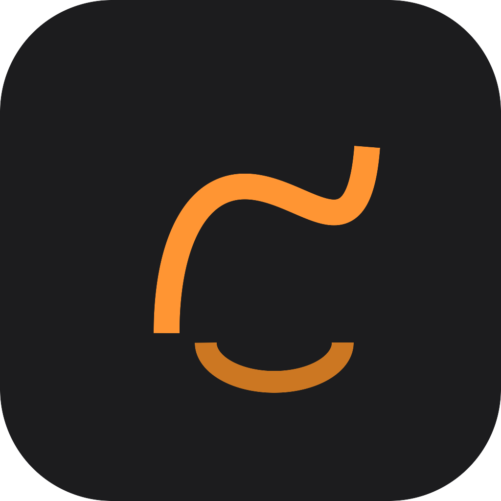

<p align="center">
  
</p>

# Gesto

A macOS-native gesture drawing reference tool for artists. Organize reference images into boards, run timed drawing sessions, and practice with distraction-free fullscreen display.

## Features

- **Board Management** -- Create boards to organize reference images by theme, project, or subject
- **Image Import** -- Drag-and-drop or file picker with automatic deduplication and thumbnail generation
- **Timed Sessions** -- Configurable timer per image (30s to 10m or custom), shuffle or sequential playback
- **Fullscreen Practice** -- Distraction-free display with keyboard-driven controls
- **Image Transforms** -- Grayscale, horizontal/vertical flip, and zoom during sessions
- **Session History** -- Track practice sessions with weekly summaries and per-board filtering

## Keyboard Controls (Practice Mode)

| Key | Action |
|-----|--------|
| Space | Pause / Resume |
| Left/Right or A/D | Previous / Next image |
| G | Toggle grayscale |
| F | Flip horizontal |
| V | Flip vertical |
| + / - | Zoom in / out |
| R | Reset transforms |
| Esc | End session |
| ? | Toggle controls help |

## Requirements

- macOS 14 (Sonoma) or later

## Tech Stack

- SwiftUI
- SwiftData
- ImageIO for thumbnail generation
- CryptoKit for image deduplication (SHA256)

## Building

Open `Gesto.xcodeproj` in Xcode 15+ and build the `Gesto` target.

To regenerate the Xcode project from `project.yml`:

```
xcodegen generate
```

## License

All rights reserved.
